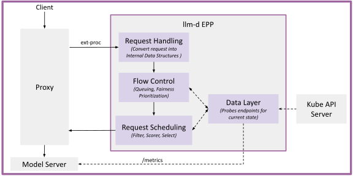
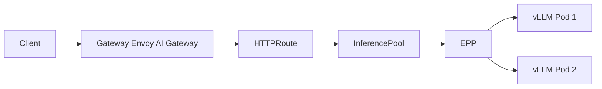
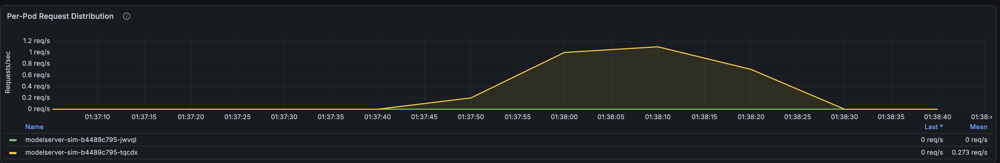
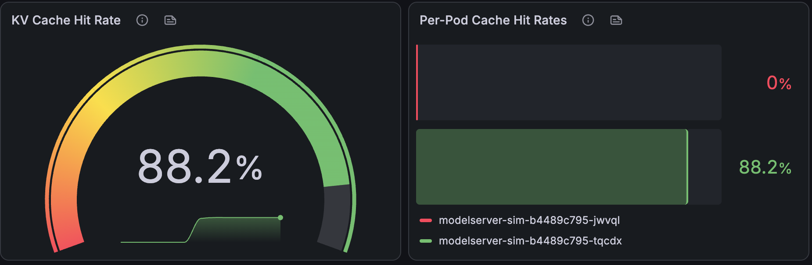
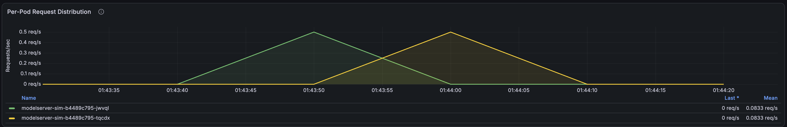
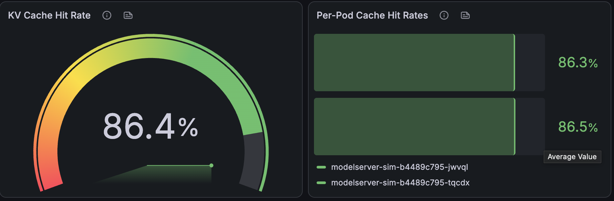

# Optimized Baseline
## 概要
[Gateway API Inference Extension](https://gateway-api-inference-extension.sigs.k8s.io/)に対応したGatewayにllm-dのEndPoint Picker(EPP)を接続することで、[Optimized Baseline](https://github.com/llm-d/llm-d/tree/release-0.8/guides/optimized-baseline)に沿って適切なルーティングを行えることを確認する。

## 公式ドキュメント
本ドキュメントの内容は、主に以下の公式ドキュメントに基づく。
- [Getting Started](https://llm-d.ai/docs/getting-started)
- [Quickstart](https://llm-d.ai/docs/getting-started/quickstart)
- [llm-d GitHub Repository](https://github.com/llm-d/llm-d)
- [Optimized Baseline](https://llm-d.ai/docs/well-lit-paths/foundations/optimized-baseline)
- [Optimized Baseline Guide](https://github.com/llm-d/llm-d/tree/main/guides/optimized-baseline)
- [llm-d-inference-sim Repository](https://github.com/llm-d/llm-d-inference-sim)


## Endpoint Picker(EPP)
`llm-d Router`の`Endpoint Picker(EPP)`では以下のようなアーキテクチャでリクエストの転送先エンドポイントの選択や、リクエストの優先順位付けを行う。

- [Endpoint Picker (EPP) Design](https://github.com/llm-d/llm-d/tree/main/docs/architecture/core/router/epp)
  -  [Request Handling](https://github.com/llm-d/llm-d/blob/main/docs/architecture/core/router/epp/request-handling.md)：プロキシから受け取ったリクエストを内部データ構造へ変換
  -  [Flow Control](https://github.com/llm-d/llm-d/blob/main/docs/architecture/core/router/epp/flow-control.md)：過負荷時のキューイングやテナント間の優先度・公平性の制御
  -  [Request Scheduling](https://github.com/llm-d/llm-d/blob/main/docs/architecture/core/router/epp/scheduling.md)：InferencePoolから最適なエンドポイントを選択
  -  [Data Layer](https://github.com/llm-d/llm-d/blob/main/docs/architecture/core/router/epp/datalayer.md)：Kubernetesやモデルサーバーのメトリクスを非同期で監視・保持

各フェーズはPluginによる拡張が可能で、各種Pluginが以下に格納されている。
- [Plugins](https://github.com/llm-d/llm-d-router/tree/main/pkg/epp/framework/plugins)



### Optimized Baseline Plugins
llm-dの[Optimized Baseline](https://github.com/llm-d/llm-d/tree/main/guides/optimized-baseline)で主に採用されているPluginは以下の通り。

※明示的に指定していない場合は、デフォルトのPluginおよび設定が適用される。

- [Scheduling Plugins](https://github.com/llm-d/llm-d-router/tree/main/pkg/epp/framework/plugins/scheduling): `Request Scheduling`において、推論リクエストに応じた適切なエンドポイントを選択するためのプラグイン(Filter -> Score -> Pickの順に処理される)
  - [prefix-cache-affinity-filter](https://github.com/llm-d/llm-d-router/tree/main/pkg/epp/framework/plugins/scheduling/filter/prefixcacheaffinity)
    - プロンプトのキャッシュを十分に保持しているエンドポイントに候補を絞り込むフィルタリングを行う
  - [token-load-scorer](https://github.com/llm-d/llm-d-router/tree/main/pkg/epp/framework/plugins/scheduling/scorer/tokenload)
    - 各エンドポイントの待機キューのリクエスト数をリアルタイムに計測し、混雑しているエンドポイントを避けて新しいトラフィックを分散させるためのスコアリングを行う
- [Request-Control Data Producer Plugins](https://github.com/llm-d/llm-d-router/tree/main/pkg/epp/framework/plugins/requestcontrol/dataproducer): `Request Scheduling`で使用する属性値をリクエストに付加したりエンドポイントに設定する
  - [approx-prefix-cache-producer](https://github.com/llm-d/llm-d-router/tree/main/pkg/epp/framework/plugins/requestcontrol/dataproducer/approximateprefix)
    - 過去のリクエストと共通するPrefixをどのエンドポイントがキャッシュとして保持しているかを判定・追跡
  - [inflight-load-producer](https://github.com/llm-d/llm-d-router/tree/main/pkg/epp/framework/plugins/requestcontrol/dataproducer/inflightload)
    - 各エンドポイントで現在処理中のリクエスト数や処理中のトークン数をリアルタイムに追跡・計測

今回のPlugin構成は`router/optimized-baseline.values.yaml`で定義された以下の通り。

`optimized-baseline/router/optimized-baseline.values.yaml`
```yaml
        apiVersion: llm-d.ai/v1alpha1
        kind: EndpointPickerConfig
        plugins:
        - type: approx-prefix-cache-producer
        - type: inflight-load-producer
        - type: prefix-cache-affinity-filter
        - type: token-load-scorer
        schedulingProfiles:
        - name: default
          plugins:
          - pluginRef: prefix-cache-affinity-filter
          - pluginRef: token-load-scorer
```

## 構成
> [!NOTE]
> llm-dには`Standalone Mode`と`Gateway Mode`の2種類の起動モードがある。([参考](https://github.com/llm-d/llm-d/blob/release-0.8/docs/architecture/core/router/proxy.md#standalone-mode))
>
> [Standalone Mode](https://github.com/llm-d/llm-d/blob/release-0.8/docs/architecture/core/router/proxy.md#standalone-mode)ではRouter Podにリクエストを受け付けるProxyとEndPoint Picker(EPP)が内包される構成であるのに対し、[Gateway Mode](https://github.com/llm-d/llm-d/blob/release-0.8/docs/architecture/core/router/proxy.md#gateway-mode-inference-gateway)では、llm-d RouterはEPPのみを持ち、ProxyはGateway側に分離される構成になる。

- [Gateway Mode](https://github.com/llm-d/llm-d/blob/release-0.8/docs/architecture/core/router/proxy.md#gateway-mode-inference-gateway)でllm-d Routerを起動する
  - GatewayとしてGateway API Inference Extensionに対応した[Envoy AI Gateway](https://aigateway.envoyproxy.io/)を使用する

- [Optimized Baseline](https://github.com/llm-d/llm-d/tree/release-0.8/guides/optimized-baseline)と呼ばれる基本設定でllm-d Routerを起動する
  - `Prefix-Aware Scheduling`
    - リクエストのprefixに対応するKV Cacheをすでに保持しているモデルサーバーへルーティング
  - `Load-Aware Scheduling`
    - モデルサーバーのメトリクスを監視し、負荷の低いモデルサーバーへルーティング

- 推論PodにはGPU環境でvLLMを稼働させた状態をエミュレートする[ghcr.io/llm-d/llm-d-inference-sim](https://github.com/llm-d/llm-d-inference-sim)を用いる
  - 各推論Podには`vllm launch render`を実行する`vllm-render`をsidecarとして追加し、simulatorから `--render-url=http://localhost:8082` で参照する
  - backend では`--enable-kvcache=true`を有効化し、`POD_IP`を注入してsimulatorのKV cacheエミュレーションを動かす
  - backendのlatency設定は以下を明示することで、prompt長と負荷に応じて待ち時間が伸びる実GPU vLLM寄りの挙動を再現する
    - `--latency-calculator=per-token`
    - `--prefill-overhead`
    - `--prefill-time-per-token`
    - `--inter-token-latency`
    - `--time-factor-under-load` 
  - 以下を明示し、block hashing と event batching を安定化する
    - `--kv-cache-size`
    - `--block-size`
    - `--hash-seed`
    - `--event-batch-size` 





## 手順
### 1. Namespaceの作成
検証用Namespaceを作成する。
```bash
kubectl apply -f namespace.yaml
```

### 2. Gatewayの作成
Gatewayおよび関連するリソースを作成する。

```bash
kubectl apply -f gateway
```

### 3. llm-d Routerのインストール
llm-d RouterをGateway Modeでインストールする。
- [llm-d Router Helm Charts](https://github.com/llm-d/llm-d-router/tree/main/config/charts)

`EPP Deployment`、`HTTPRoute`、`InferencePool`を作成する。
```bash
helm upgrade --install optimized-baseline \
  oci://ghcr.io/llm-d/charts/llm-d-router-gateway \
  --version v0.10.0 \
  --namespace llm-d-optimized-baseline \
  -f router/optimized-baseline.values.yaml
```

> [!NOTE]
> Gateway Modeでは、ホストするモデル(`InferencePool`)毎に`HTTPRoute`と`EPP`を用意する。
参考: [Multi-Inference Pool Setup](https://github.com/llm-d/llm-d/tree/main/guides/workload-autoscaling/multi-inference-pool)


llm-d Routerが作成したリソースを確認する。
```bash
kubectl get httproute optimized-baseline -n llm-d-optimized-baseline

kubectl get inferencepool optimized-baseline -n llm-d-optimized-baseline

kubectl get pods -n llm-d-optimized-baseline
```

### 4. modelserverのデプロイ

modelserverデプロイ時に適用されるマニフェストを確認する。
ここでは推論ワークロードとしてreplica数2の`Deployment`と`Service`のマニフェストが表示される。
```bash
kubectl kustomize modelserver
```

マニフェストを適用して`Deployment`と`Service`を作成する。
```bash
kubectl apply -k modelserver
```

推論ワークロードのPodがRunningになったことを確認する。
```bash
kubectl get pods -l llm-d.ai/guide=optimized-baseline -n llm-d-optimized-baseline
```

### 5. modelserverへのリクエスト送信

Gatewayに対応するService名を取得する。
```bash
export GATEWAY_SERVICE_NAME=$(kubectl get svc -n envoy-gateway-system \
  -l gateway.envoyproxy.io/owning-gateway-name=llm-d-inference-gateway \
  -o jsonpath='{.items[0].metadata.name}')

echo "${GATEWAY_SERVICE_NAME}"
```

取得したService名を使って、別ターミナルでport-forwardする。
```bash
kubectl port-forward -n envoy-gateway-system svc/${GATEWAY_SERVICE_NAME} 8080:80
```

#### 5.1. OpenAI互換APIへのリクエスト送信

`/v1/models`を呼び出し、Gateway経由でモデル一覧を取得できることを確認する。
```bash
curl -s http://127.0.0.1:8080/v1/models | jq .
```

`/v1/completions`を呼び出し、推論リクエストを送信する。(今回は推論ワークロードとしてシミュレーター`llm-d-inference-sim`を使用しているため、実際の推論結果が返却されるわけではない点に注意)
```bash
curl -s http://127.0.0.1:8080/v1/completions \
  -H 'Content-Type: application/json' \
  -d '{
    "model": "Qwen/Qwen2.5-0.5B-Instruct",
    "prompt": "Explain how Gateway API and llm-d work together.",
    "max_tokens": 64,
    "temperature": 0
  }' | jq .
```

### 6. llmd Routerの動作確認
Gatewayを経由して特性の異なる推論リクエストを送信した際、`llm-d Router`の`Endpoint Picker(EPP)`により、どのようなルーティングが行われるかを確認する。

#### 6.1. 共通prefixを持つリクエストを順番に送信
共通prefixを持つリクエストを順番に送信する。
ほぼ同じpromptを連続で送るため、`prefix-cache-affinity-filter`により2つの推論PodのうちKV Cacheがヒットしやすい一方のPodのみにリクエストが集中することを確認する。

> [!NOTE]
> [approx-prefix-cache-producer](https://github.com/llm-d/llm-d-router/tree/main/pkg/epp/framework/plugins/requestcontrol/dataproducer/approximateprefix)は、リクエストに含まれるpromptを一定の長さのblockに分けて、どの推論Podがそのblockを処理したかを記録する。
>
> blockの長さについて、`autoTune=true`ではモデルサーバーのメトリクスから取得するが、llm-d Router v0.9.0以降では取得元にかかわらず最小値として64 tokenが適用される。([llm-d-router PR #1160](https://github.com/llm-d/llm-d-router/pull/1160))
>
> 今回のsimulatorは`--block-size=16`で動作するため、EPPがprefixの追跡に使うblockの長さは`max(16, 64) = 64 token`になる。
>
> [prefix-cache-affinity-filter](https://github.com/llm-d/llm-d-router/tree/main/pkg/epp/framework/plugins/scheduling/filter/prefixcacheaffinity)は、現在のリクエストに含まれるtokenを64 tokenで区切ったblockと、過去に各推論Podへルーティングされたpromptのblockを比較する。
>
> 現在のリクエストのblockのうち、その推論Podに記録済みのblockと一致する割合が`affinityThreshold=0.80`以上であれば、その推論Podだけを候補として残す。
>
> ただし`prefix-cache-affinity-filter`ではInflight Loadから推定したTTFTも評価し、prefixが一致する推論Podの推定TTFTが他の推論Podより`maxTTFTPenaltyMs=18000`(デフォルト値)を超える場合は、全ての推論Podを候補に戻す。
>
> ここではpromptに含まれる固定文を長くすることで過去に記録されたtoken blockとリクエストに含まれるtoken blockが一致しやすい状況(一致する割合が0.8を超える)を作り出し、一度prefixを処理した推論Podへリクエストが集中しやすい状況を再現している。
> 例えば、6 blockのうち5 blockが一致した場合のprefix scoreは次のようになり、`affinityThreshold=0.80`を超える。
>
> ```math
> \text{prefix score}
> =
> \frac{\text{一致 block 数}}{\text{全 block 数}}
> =
> \frac{5}{6}
> \approx
> 0.833
> ```
>

```bash
for i in $(seq 1 30); do
  curl -s http://127.0.0.1:8080/v1/chat/completions \
    -H 'Content-Type: application/json' \
    -d '{
      "model": "Qwen/Qwen2.5-0.5B-Instruct",
      "messages": [
        {
          "role": "user",
          "content": "llm-d prefix-affinity validation uses a deliberately repeated fixed prefix so that the Endpoint Picker can associate several complete routing blocks with one backend before the unique request suffix is appended. The shared prefix describes how prefix locality keeps related requests close to warm KV cache state and reduces repeated prefill work on the selected backend. The Endpoint Picker first identifies backends that already hold matching prefix blocks and then narrows the candidate set when the matching-block ratio exceeds the configured affinity threshold. Inflight load remains part of the scheduling decision so that cache locality does not force traffic onto a backend whose estimated time to first token is substantially worse. The token-load scorer compares the remaining candidates and favors the backend with less queued and running token work after prefix-affinity filtering has completed. Sequential requests allow each response to finish before the next request arrives, keeping inflight load low and making prefix reuse the dominant signal in this validation. Repeating the same long prefix creates enough complete 64-token routing blocks for the default affinity threshold while the short unique suffix changes only the final block. This request verifies that subsequent calls remain associated with the backend selected for the first call and therefore improve cache reuse in the simulator-based optimized baseline. request-'"${i}"'"
        }
      ],
      "max_tokens": 128,
      "temperature": 0
    }' > /dev/null
done
```

Grafanaの`llm-d Performance Dashboard`にて
- `Per-Pod Request Distribution`
- `Per-Pod Cache Hit Rates`

を確認すると、KV Cacheを再利用しやすい特定の推論Podにリクエストが集中していることが確認できる。




#### 6.2. 共通prefixを持つリクエストを並列で送信
共通prefixを持つリクエストを並列で送信する。
並列リクエストにより、まだ処理中のリクエストが各推論Podに同時に送信されている状態(Inflight Load)が作られるため、KV Cacheのヒットしやすさだけでなく推論Pod負荷も考慮しながらリクエストが振り分けられる。

```bash
for i in $(seq 1 30); do
  curl -s http://127.0.0.1:8080/v1/chat/completions \
    -H 'Content-Type: application/json' \
    -d '{
      "model": "Qwen/Qwen2.5-0.5B-Instruct",
      "messages": [
        {
          "role": "user",
          "content": "Explain request routing in this llm-d optimized baseline scenario in one compact paragraph, including the role of prefix-cache affinity, inflight load, and the final token-based scoring decision across two simulator backends. run-'"${i}"'"
        }
      ],
      "max_tokens": 128,
      "temperature": 0
    }' > /dev/null &
done
wait
```

Grafanaの`llm-d Performance Dashboard`にて
- `Per-Pod Request Distribution`
- `Per-Pod Cache Hit Rates`

を確認すると、2つの推論Podにリクエストが分散されていることが確認できる。



## クリーンアップ

```bash
kubectl delete -f gateway
helm uninstall optimized-baseline -n llm-d-optimized-baseline
kubectl delete -k modelserver
kubectl delete -f namespace.yaml
```