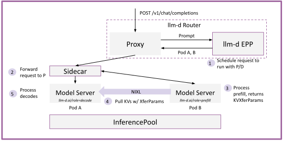
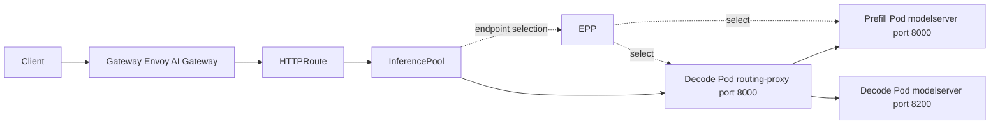
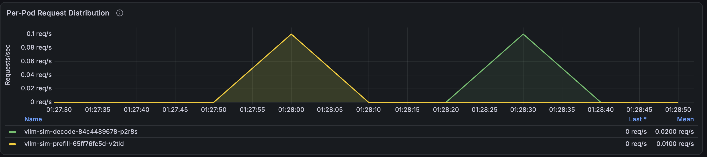

# P/D Disaggregation
## 公式ドキュメント
本ドキュメントの内容は、主に以下の公式ドキュメントに基づく。
- [Getting Started](https://llm-d.ai/docs/getting-started)
- [Quickstart](https://llm-d.ai/docs/getting-started/quickstart)
- [llm-d GitHub Repository](https://github.com/llm-d/llm-d)
- [P/D Disaggregation](https://llm-d.ai/docs/well-lit-paths/foundations/pd-disaggregation)
- [P/D Disaggregation Guide](https://github.com/llm-d/llm-d/tree/main/guides/pd-disaggregation)
- [Disaggregated Serving](https://llm-d.ai/docs/architecture/advanced/disaggregation)
- [llm-d-inference-sim Repository](https://github.com/llm-d/llm-d-inference-sim)

## 概要
[Gateway API Inference Extension](https://gateway-api-inference-extension.sigs.k8s.io/)に対応したGatewayにllm-dのEndPoint Picker(EPP)を接続することで、[P/D Disaggregation](https://llm-d.ai/docs/well-lit-paths/foundations/pd-disaggregation)が実現できることを確認する。
  

## P/D Disaggregation

LLMによる推論は以下2つのフェーズに分けられる。
- `prefill`: 最初に与えられた入力プロンプト全体を処理するフェーズ
- `decode`: その後に新しく出力トークンを1トークンずつ生成していくフェーズ


|          | prefill    | decode            |
| -------- | ---------- | ----------------- |
| 処理対象     | 入力プロンプト全体  | 新しく生成された1トークン     |
| Q/K/V    | 全入力トークン分計算 | 新規トークン分だけ計算       |
| KV Cache | 構築する       | 既存Cacheを利用しつつ追加する |
| 実行回数     | 基本1回       | 出力トークン数だけ繰り返す     |
| 並列性      | 高い         | 低い                |
| 主なボトルネック | 計算量        | メモリ帯域             |

```
入力プロンプト
      │
      ▼
┌─────────────┐
│   prefill   │
│ 全入力を処理  │
└──────┬──────┘
       │
       ├── KV Cache作成
       │
       ▼
    1トークン生成
       │
       ▼
┌─────────────┐
│   decode    │◀───┐
│  新規１token │    │
└──────┬──────┘    │
       │           │
       ├─ KV追加    │
       │           │
       ▼           │
    次token生成 ────┘
```

P/D Disaggregationでは、入力promptを処理してKV Cacheを作る`prefill`と、KV Cacheを使って出力tokenを生成する`decode`を別の推論Podで実行する。




### P/D Disaggregation Plugins
llm-dの[P/D Disaggregation](https://github.com/llm-d/llm-d/tree/main/guides/pd-disaggregation)で主に採用されているPluginは以下の通り。

- [prefix-based-pd-decider](https://github.com/llm-d/llm-d-router/tree/main/pkg/epp/framework/plugins/scheduling/profilehandler/disagg#prefixbasedpddecider)
  - decode endpointのprefixキャッシュと未キャッシュtoken数を基に、`prefill`を実行するか判定する
  - ここでは未キャッシュtoken数が`nonCachedTokens=16`以上なら`prefill` + `decode`を選択する
  - `prefix-based-pd-decider`の代わりに[always-disagg-pd-decider](https://github.com/llm-d/llm-d-router/tree/main/pkg/epp/framework/plugins/scheduling/profilehandler/disagg#alwaysdisaggpddecider)を使用すると、常に`prefill` + `decode`が選択される
- [disagg-profile-handler](https://github.com/llm-d/llm-d-router/tree/main/pkg/epp/framework/plugins/scheduling/profilehandler/disagg#disaggprofilehandler)
  - `prefill`や`decode`フェーズで用いるdeciderを指定する
  - ここでは`prefill`で`prefix-based-pd-decider`を実行し、`decode`ではdeciderを実行しない

- [prefill-filter](https://github.com/llm-d/llm-d-router/tree/main/pkg/epp/framework/plugins/scheduling/filter/bylabel#prefillrole-filter)
  - `prefill` Roleを示すLabel(`llm-d.ai/role: prefill`)を持つPodをフィルタリングする
- [decode-filter](https://github.com/llm-d/llm-d-router/tree/main/pkg/epp/framework/plugins/scheduling/filter/bylabel#decoderole-filter)
  - `decode` Roleを示すLabel(`llm-d.ai/role: decode`)を持つPodをフィルタリングする

> [!NOTE]
> [approx-prefix-cache-producer](https://github.com/llm-d/llm-d-router/tree/main/pkg/epp/framework/plugins/requestcontrol/dataproducer/approximateprefix)は、リクエストに含まれるpromptを一定の長さのblockに分けて、どの推論Podがそのblockを処理したかを記録する。
> 
> blockの長さについて、`autoTune=true`ではモデルサーバーのメトリクスから取得するが、llm-d Router v0.9.0以降では取得元にかかわらず最小値として64 tokenが適用される。([llm-d-router PR #1160](https://github.com/llm-d/llm-d-router/pull/1160))
>
> 今回のsimulatorは`--block-size=16`で動作するため、EPPがprefixの追跡に使うblockの長さは`max(16, 64) = 64 token`になる。
>
> [prefix-based-pd-decider](https://github.com/llm-d/llm-d-router/blob/71f4f0999f95b96c49a9d0c4afbd18dfdb943c26/pkg/epp/framework/plugins/scheduling/profilehandler/disagg/prefix_based_pd_decider.go#L146-L152)では`approx-prefix-cache-producer`が生成した`PrefixCacheMatchInfo`に含まれる実効blockサイズを元に、以下の計算式でhitPrefixTokens(prefixキャッシュにヒットしたtoken数)を算出する
> 
> ```math
> \text{hitPrefixTokens}
> =
> {\text{一致 block 数}}×{\text{64}}
> ```


今回のPlugin構成は`pd-disaggregation/router/pd-disaggregation.values.yaml`で定義された以下の通り。
EPPの`prefix-based-pd-decider`はdecode endpointにある既知のprefixを基に、未キャッシュtoken数を評価する。
この構成では短いrequestでも初回にP/Dを選択するため、`nonCachedTokens: 16`を指定する。

`pd-disaggregation/router/pd-disaggregation.values.yaml`
```yaml
        apiVersion: llm-d.ai/v1alpha1
        kind: EndpointPickerConfig
        plugins:
        # - type: always-disagg-pd-decider  # すべてのrequestでP/Dを実行する比較用の固定判定
        - type: prefix-based-pd-decider
          parameters:
            # 未キャッシュtoken数がこの値以上ならprefill + decodeを選択する
            # 短い検証requestでも初回をP/D、同一requestの再送をdecode-onlyにする
            nonCachedTokens: 16
        - type: disagg-profile-handler
          parameters:
            deciders:
              # prefill: always-disagg-pd-decider
              prefill: prefix-based-pd-decider # prefillを実行するか判定するdecider
        - type: prefill-filter
        - type: decode-filter
        - type: approx-prefix-cache-producer
          parameters:
            # 5k-ISL gpt-oss-120b reference workload; a modest match window
            # keeps EPP prefix-matching cheap.
            maxPrefixTokensToMatch: 131072
        - type: inflight-load-producer
        - type: prefix-cache-affinity-filter
          parameters:
            # Measured with guides/recipes/router/calibration/calibrate.sh
            # through the full P/D path on the reference fleet (gpt-oss-120b,
            # 8x prefill TP=1 on H200, chunk 8192). Includes the NIXL KV
            # transfer + sidecar hop, so it is the operational ceiling the
            # gate acts on. Re-measure for other hardware/models.
            peakPrefillThroughput: 33821
        - type: token-load-scorer
        - type: active-request-scorer
        - type: max-score-picker
        schedulingProfiles:
        # Prefill does the prompt pass: keep prefix groups on cache-warm pods
        # (affinity filter) and pick by queued prefill token load.
        - name: prefill
          plugins:
          - pluginRef: prefill-filter
          - pluginRef: prefix-cache-affinity-filter
          - pluginRef: token-load-scorer
          - pluginRef: max-score-picker
        # Pure decode is bound by concurrent in-flight requests, not prefill
        # throughput: pick the least-busy endpoint.
        - name: decode
          plugins:
          - pluginRef: decode-filter
          - pluginRef: active-request-scorer
          - pluginRef: max-score-picker
```

- EPPがdecode endpointを選択する
- `prefix-based-pd-decider`が未キャッシュtoken数を評価する。
- P/Dを実行する場合、EPPはprefill endpointも選択し、`x-prefiller-host-port` headerへ設定する
- Gatewayは元のrequestをdecode endpointの`routing-proxy`へ送る
- `routing-proxy`はprefill用requestをprefill endpointへ送り、その応答から `kv_transfer_params`を取得する
- `routing-proxy`は`kv_transfer_params`をdecode用requestへ追加し、同じPodのdecode modelserverへ送る
- headerがない場合、`routing-proxy`はremote prefillを省略し、decode modelserverへ直接送る

## 構成
- [Gateway Mode](https://github.com/llm-d/llm-d/blob/release-0.8/docs/architecture/core/router/proxy.md#gateway-mode-inference-gateway)でllm-d Routerを起動する
  - GatewayとしてGateway API Inference Extensionに対応した[Envoy AI Gateway](https://aigateway.envoyproxy.io/)を使用する
- P/D Disaggregation構成でllm-d Routerを起動する
  - 一定以上のキャッシュトークン数がある場合は`prefill`をスキップして`decode`し、そうでない場合は`prefill`を実行してから`decode`を実行する
- 推論PodにはGPU環境でP/D構成のvLLMを稼働させた状態をエミュレートする[ghcr.io/llm-d/llm-d-inference-sim](https://github.com/llm-d/llm-d-inference-sim)を用いる
  - prefill Podとdecode Podを別Deploymentとして起動する
  - decode Podにのみ、port 8000で待ち受ける`routing-proxy`をsidecarとして追加する
  - decode modelserverはport 8200で待ち受ける
  - 各推論Podには`vllm launch render`を実行する`vllm-render`をsidecarとして追加し、simulatorから`--render-url=http://localhost:8082`で参照する
  - Kustomizeでbackend discovery用の`llm-d.ai/guide=pd-disaggregation-sim`ラベルをPod templateとService selectorへ付与し、Routerの`modelServers.matchLabels`と揃える
  - backendは`--mode=random`で応答させる
  - backendでは`--enable-kvcache=true`を有効化し、`POD_IP`を注入してsimulatorのKV cacheエミュレーションを動かす
  - backendのlatency設定は以下を明示することで、prompt長と負荷に応じて待ち時間が伸びる実GPU vLLM寄りの挙動を再現する
    - `--latency-calculator=per-token`
    - `--prefill-overhead`
    - `--prefill-time-per-token`
    - `--inter-token-latency`（decode backendのみ）
    - `--time-factor-under-load`
  - 以下を明示し、block hashingとevent batchingを安定化する
    - `--kv-cache-size`
    - `--block-size`
    - `--hash-seed`
    - `--event-batch-size`




## 手順
### 1. Namespaceの作成
検証用Namespaceを作成する。
```bash
kubectl apply -f namespace.yaml
```

### 2. Gatewayの作成
Gatewayおよび関連するリソースを作成する。

```bash
kubectl apply -f gateway
```

### 3. llm-d Routerのインストール
llm-d RouterをGateway Modeでインストールする。
- [llm-d Router Helm Charts](https://github.com/llm-d/llm-d-router/tree/main/config/charts)

`EPP Deployment`、`HTTPRoute`、`InferencePool`を作成する。
```bash
helm upgrade --install pd-disaggregation \
  oci://ghcr.io/llm-d/charts/llm-d-router-gateway \
  --version v0.10.0 \
  --namespace llm-d-pd-disaggregation \
  -f router/pd-disaggregation.values.yaml
```

> [!NOTE]
> Gateway Modeでは、ホストするモデル(`InferencePool`)毎に`HTTPRoute`と`EPP`を用意する。
参考: [Multi-Inference Pool Setup](https://github.com/llm-d/llm-d/tree/main/guides/workload-autoscaling/multi-inference-pool)


llm-d Routerが作成したリソースを確認する。
```bash
kubectl get httproute pd-disaggregation -n llm-d-pd-disaggregation

kubectl get inferencepool pd-disaggregation -n llm-d-pd-disaggregation

kubectl get pods -n llm-d-pd-disaggregation
```

### 4. modelserverのデプロイ
prefill Podとdecode Podをデプロイする。

`Deployment`と`Service`のマニフェストが表示されることを確認する。
```bash
kubectl kustomize modelserver
```

ここでは以下を確認する。

- prefill(`vllm-sim-prefill`)とdecode(`vllm-sim-decode`)のDeploymentが個別に作成されること
  - prefill Podに`llm-d.ai/role=prefill`、decode Podに`llm-d.ai/role=decode`が設定されていること
  - decode Podに`routing-proxy`のsidecarが追加されること
- prefill Serviceの8000番がprefill modelserverを参照すること
- decode Serviceの8000番が`routing-proxy`を参照し、decode modelserverは8200番で待ち受けること

`Deployment`と`Service`を作成する。
```bash
kubectl apply -k modelserver
```

ここまでで作成したリソースの状態を確認する。
```bash
kubectl get gateway,httproute,inferencepool -n llm-d

kubectl get pods -n llm-d

kubectl get svc -n llm-d

kubectl get pods -n llm-d \
  -l llm-d.ai/guide=pd-disaggregation-sim \
  -L llm-d.ai/role
```

推論ワークロードのPodがRunningになったことを確認する。
```bash
kubectl get pods -l llm-d.ai/guide=pd-disaggregation-sim -n llm-d-pd-disaggregation
```

ここではprefillとdecodeそれぞれのDeploymentに紐づくPodが作成される。
```bash
NAME                                READY   STATUS    RESTARTS   AGE
vllm-sim-decode-84c4489678-p2r8s    3/3     Running   0          79s
vllm-sim-prefill-65ff76fc5d-v2tld   2/2     Running   0          79s
```

### 5. modelserverへのリクエスト送信
Gatewayに対応するService名を取得する。

```bash
export GATEWAY_SERVICE_NAME=$(kubectl get svc -n envoy-gateway-system \
  -l gateway.envoyproxy.io/owning-gateway-name=llm-d-inference-gateway \
  -o jsonpath='{.items[0].metadata.name}')
echo "${GATEWAY_SERVICE_NAME}"
```

取得したService名を使って、別ターミナルでport-forwardする。

```bash
kubectl port-forward -n envoy-gateway-system svc/${GATEWAY_SERVICE_NAME} 8080:80
```

#### 5.1. OpenAI互換APIへのリクエスト送信
`/v1/models` を呼び出し、Gateway経由でモデル一覧を取得できることを確認する。

```bash
curl -s http://127.0.0.1:8080/v1/models | jq .
```

`/v1/completions`を呼び出し、推論リクエストを送信する。(今回は推論ワークロードとしてシミュレーター`llm-d-inference-sim`を使用しているため、実際の推論結果が返却されるわけではない点に注意)

```bash
curl -s http://127.0.0.1:8080/v1/chat/completions \
  -H 'Content-Type: application/json' \
  -d '{
    "model": "Qwen/Qwen2.5-0.5B-Instruct",
    "messages": [
      {
        "role": "user",
        "content": "pd-flow-validation-001: Explain how Gateway API and llm-d P/D disaggregation work together."
      }
    ],
    "max_tokens": 64,
    "temperature": 0
  }' | jq .
```

### 6. P/D分離の動作確認
Gatewayを経由して推論リクエストを送信した際、`llm-d Router`の`Endpoint Picker(EPP)`により、P/D Disaggregationが行われることを確認する。

#### 6.1. 共通prefixを持つリクエストを順番に送信
共通のprefixを持つpromptを2回送信した場合、P/D Disaggregationにより1回目は`prefill` + `decode`が実行され、2回目は`decode-only`が実行されることを確認する。

1回目のリクエストは、`nonCachedTokens: 16`(EPPに未キャッシュのtoken数がこの値以上の場合に`prefill + decode`を選択する閾値)に指定した16 tokenを十分に超えるprefixを含むプロンプトを送信する。
この時`prefill` + `decode`が実行される。
```bash
curl -s http://127.0.0.1:8080/v1/chat/completions \
  -H 'Content-Type: application/json' \
  -d '{
    "model": "Qwen/Qwen2.5-0.5B-Instruct",
    "messages": [
      {
        "role": "user",
        "content": "pd-long-shared-prefix-validation: This shared context describes a repeatable P/D validation workload. The prefill phase processes the complete input prompt and constructs reusable KV cache state. The decode phase receives that prepared state and generates output tokens incrementally. Gateway API forwards the OpenAI-compatible request to llm-d, and the EPP chooses the applicable endpoints. Keep every sentence in this shared context identical for both requests so the approximate prefix index can match complete token blocks. The first request establishes the prefix state on the decode endpoint. The second request reuses the exact same shared context, while only its final validation suffix differs. This text intentionally exceeds sixty-four tokens before the suffix. Validation suffix: request-1."
      }
    ],
    "max_tokens": 64,
    "temperature": 0
  }' | jq .
```

2回目のリクエストでは、1回目のリクエストと同一のprefixを持ち、末尾だけ異なるsuffixで構成されるプロンプトを送信する。
未キャッシュtoken数が`nonCachedTokens: 16`を下回るため、`decode-only`となる。
```bash
curl -s http://127.0.0.1:8080/v1/chat/completions \
  -H 'Content-Type: application/json' \
  -d '{
    "model": "Qwen/Qwen2.5-0.5B-Instruct",
    "messages": [
      {
        "role": "user",
        "content": "pd-long-shared-prefix-validation: This shared context describes a repeatable P/D validation workload. The prefill phase processes the complete input prompt and constructs reusable KV cache state. The decode phase receives that prepared state and generates output tokens incrementally. Gateway API forwards the OpenAI-compatible request to llm-d, and the EPP chooses the applicable endpoints. Keep every sentence in this shared context identical for both requests so the approximate prefix index can match complete token blocks. The first request establishes the prefix state on the decode endpoint. The second request reuses the exact same shared context, while only its final validation suffix differs. This text intentionally exceeds sixty-four tokens before the suffix. Validation suffix: request-2."
      }
    ],
    "max_tokens": 64,
    "temperature": 0
  }' | jq .
```

Grafanaの`llm-d Performance Dashboard`にて`Per-Pod Request Distribution`を確認すると、以下のような挙動が確認できる。
- 1回目のリクエストでは`prefill`と`decode`それぞれのPodにリクエストが送信されている
- 2回目のリクエストでは`decode`のPodのみにリクエストが送信されている



## クリーンアップ

```bash
kubectl delete -k modelserver
helm uninstall pd-disaggregation -n llm-d-pd-disaggregation
kubectl delete -f gateway
kubectl delete -f namespace.yaml
```