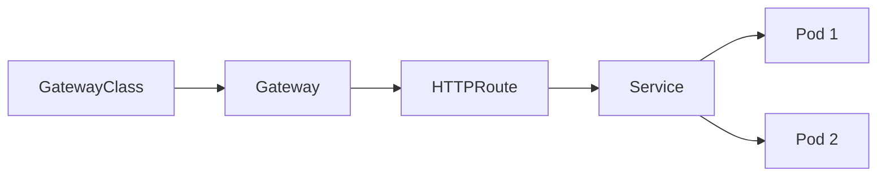
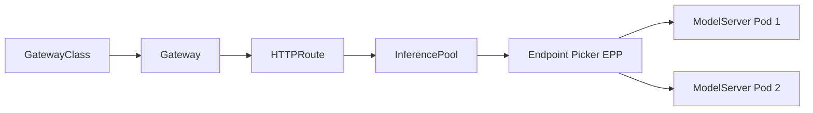

# Gateway API
## 概要
Gateway APIを実装したGatewayとして[Envoy AI Gateway](https://aigateway.envoyproxy.io/)をインストールする。また、llm-dで使用する推論ワークロード向けの拡張機能として[Gateway API Inference Extension](https://gateway-api-inference-extension.sigs.k8s.io/)をインストールする。

## 公式ドキュメント
本ドキュメントの内容は、主に以下の公式ドキュメントに基づく。
- [Gateway Guides](https://github.com/llm-d/llm-d/tree/release-0.8/docs/infrastructure/gateway)
- [Envoy AI Gateway](https://github.com/llm-d/llm-d/blob/release-0.8/docs/infrastructure/gateway/envoy-ai-gateway.md)
- [Gateway Recipes](https://github.com/llm-d/llm-d/tree/release-0.8/guides/recipes/gateway)


## Gateway API
[Gateway API](https://kubernetes.io/docs/concepts/services-networking/gateway/)はKubernetes上のPodに対するルーティングをAPIで管理する仕組み。

- `GatewayClass`
  - Gateway APIに対応したコントローラを識別するためのリソース
- `Gateway`
  - クライアントがリクエストを行うエンドポイントを定義するリソース
- `HTTPRoute`
  - Gatewayに到達したHTTPリクエストのルーティングルールを定義するリソース
  - 通常はリクエストを送信する`Service`を指定する(今回の構成ではGateway API Inference Extensionにより`InferencePool`を指定する)



## Gateway API Inference Extension
[Gateway API Inference Extension](https://gateway-api-inference-extension.sigs.k8s.io/)はGateway APIを推論ワークロード向けに拡張する仕組み。

- `InferencePool`
  - 推論ワークロードをGateway APIで扱うための論理的な集合を表すリソース
  - `HTTPRoute`から見たリクエストの送信先に当たる
- `Endpoint Picker(EPP)`
  - 推論ワークロードの状態に応じて、`InferencePool`から適切なPodを選択する
  - `llm-d`が提供する


  

## 手順
### 1. Gateway API CRDのインストール
`Gateway`、`HTTPRoute`、`ReferenceGrant` などGateway API CRDをインストールする。

```bash
kubectl apply --server-side -f https://github.com/kubernetes-sigs/gateway-api/releases/download/v1.6.1/standard-install.yaml
```

### 2. Gateway API Inference Extension CRDのインストール
Gateway API Inference Extension CRD(`InferencePool`)をインストールする。

```bash
kubectl apply -f https://github.com/kubernetes-sigs/gateway-api-inference-extension/releases/download/v1.6.0/v1-manifests.yaml
```

### 3. Envoy AI Gatewayのインストール

- [llm-d Envoy AI Gateway](https://github.com/llm-d/llm-d/blob/main/docs/infrastructure/gateway/envoy-ai-gateway.md)
- [(参考)Envoy AI Gateway Installation](https://aigateway.envoyproxy.io/docs/getting-started/installation)

Envoy GatewayとCRDをインストール。

```bash
ENVOY_GATEWAY_VERSION=v1.9.1

helm template envoy-gateway-crds oci://docker.io/envoyproxy/gateway-crds-helm \
  --version ${ENVOY_GATEWAY_VERSION} \
  --set crds.gatewayAPI.enabled=false \
  --set crds.envoyGateway.enabled=true \
  | grep -v '^Pulled:' | grep -v '^Digest:' | kubectl apply --server-side -f -

helm upgrade -i envoy-gateway oci://docker.io/envoyproxy/gateway-helm \
  --version ${ENVOY_GATEWAY_VERSION} \
  --namespace envoy-gateway-system \
  --create-namespace \
  --skip-crds \
  -f provider/envoy-gateway/base.values.yaml
```

Envoy AI Gatewayをインストールするにあたり、
Envoy Gatewayが`InferencePool`をlist/watchするための権限を付与する。
```bash
kubectl apply -f provider/envoy-gateway/inference-access-clusterrole.yaml
```

Envoy AI GatewayとCRDをインストール。
```bash
ENVOY_AI_GATEWAY_VERSION=v1.1.0

helm upgrade -i envoy-ai-gateway-crd oci://docker.io/envoyproxy/ai-gateway-crds-helm \
  --version ${ENVOY_AI_GATEWAY_VERSION} \
  --namespace envoy-ai-gateway-system \
  --create-namespace

helm upgrade -i envoy-ai-gateway oci://docker.io/envoyproxy/ai-gateway-helm \
  --version ${ENVOY_AI_GATEWAY_VERSION} \
  --namespace envoy-ai-gateway-system \
  --create-namespace
```

`GatewayClass`を作成する。
```bash
kubectl apply -f provider/envoy-ai-gateway/gatewayclass.yaml
```

### 4. Namespaceの作成

検証用Namespaceを作成する。
```bash
kubectl apply -f namespace.yaml
```

## クリーンアップ

```bash
kubectl delete -f provider/envoy-ai-gateway/gatewayclass.yaml
helm uninstall envoy-ai-gateway -n envoy-ai-gateway-system
helm uninstall envoy-ai-gateway-crd -n envoy-ai-gateway-system
kubectl delete -f provider/envoy-gateway/inference-access-clusterrole.yaml
helm uninstall envoy-gateway -n envoy-gateway-system
helm template envoy-gateway-crds oci://docker.io/envoyproxy/gateway-crds-helm \
  --version v1.8.1 \
  --set crds.gatewayAPI.enabled=false \
  --set crds.envoyGateway.enabled=true \
  | grep -v '^Pulled:' | grep -v '^Digest:' | kubectl delete -f -
kubectl delete -f https://github.com/kubernetes-sigs/gateway-api-inference-extension/releases/download/v1.5.0/v1-manifests.yaml
kubectl delete -f https://github.com/kubernetes-sigs/gateway-api/releases/download/v1.6.0/standard-install.yaml
kubectl delete namespace envoy-ai-gateway-system
kubectl delete namespace envoy-gateway-system
```